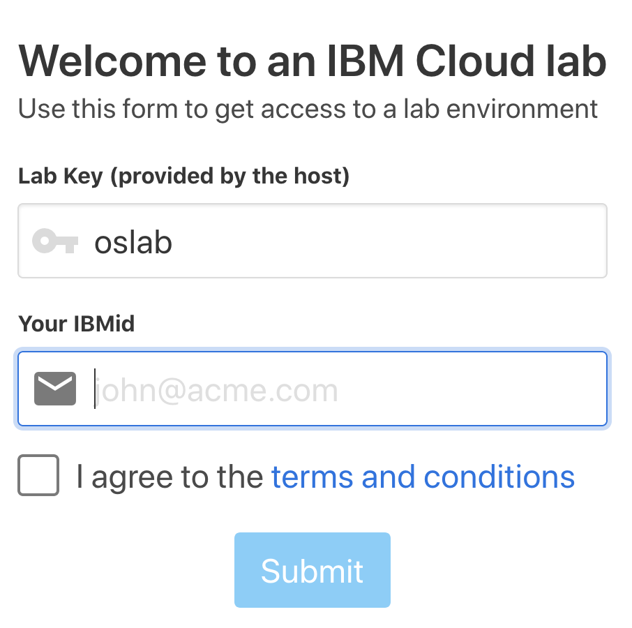
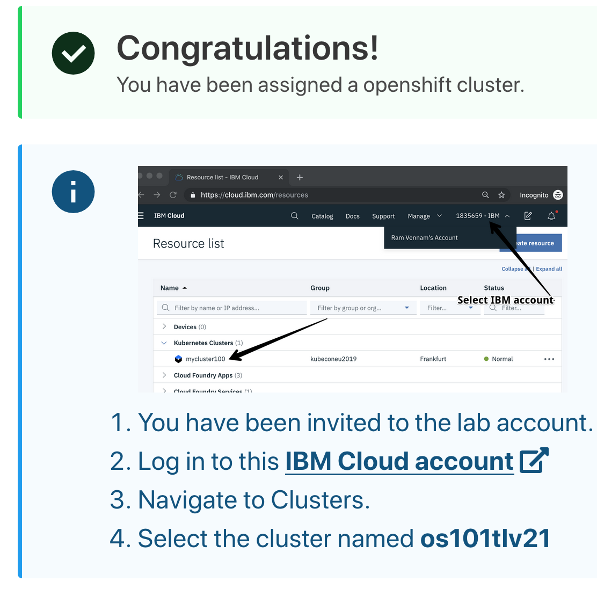

# 1. Register to IBM Cloud 

[Register IBM Cloud](https://ibm.biz/BdqZqY)

Then activate your account
‌Click on the confirmation link in the email you received from IBM to activate your cloud account. Make sure you check the spam folder in your email.

# 2 Get access to IBM Kubernetes Cluster
[access to IBM Kubernetes  Cluster]( https://os101tlv.mybluemix.net)

Use :  
     Lab Key : `oslab`
 
  IBMid : `your emailRegister to IBM Cloud`    

Then follow the instructions ( it will look like this ) 

# Step 3. Run the LAB 
# Befor you run the lab Please notice: 
1. Please run Exercise 1-4 .
2. In Exercise 4 please notice to update the correct namespace (line5 ) and Deployment name (line 14 )  https://ibm-developer.gitbook.io/openshift101/workshop/exercise-04#enable-autoscaler 

3. You could also run Exercise 6 . For that you will need to either use cloudshell with https://shell.cloud.ibm.com/ and install Docker there , or go over the [Setup CLI Access for the cluster](https://ibm-developer.gitbook.io/openshift101/getting-started/setup_cli) and then install Docker 
# The LAB 
[OpenShift 101: Learn the Basics of Red Hat OpenShift on IBM Cloud](https://ibm-developer.gitbook.io/openshift101/)

# Usefull Links :

[Call for Code](https://developer.ibm.com/callforcode/)

[IBM Developer Website](https://developer.ibm.com/)

[Watson Services](https://cloud.ibm.com/catalog?category=ai)

[IBM Cloud Dashboard](https://cloud.ibm.com/)

[OpenShift Labs](https://github.com/openshift-labs/starter-guides)

[Cloud Pak for Data](https://www.ibm.com/products/cloud-pak-for-data )

